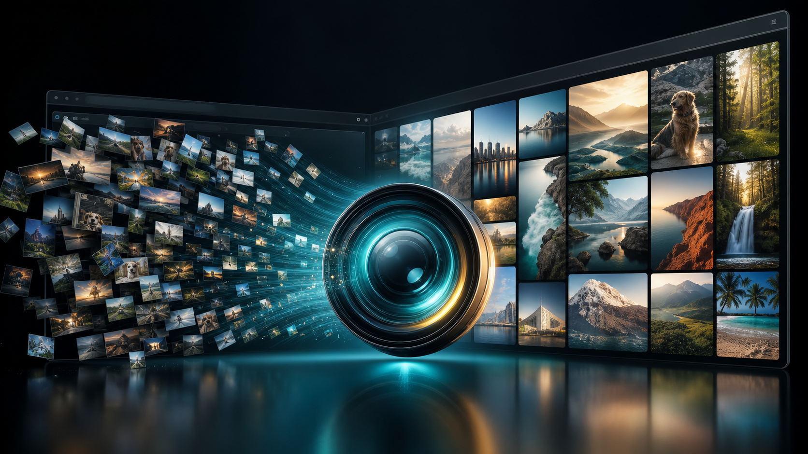
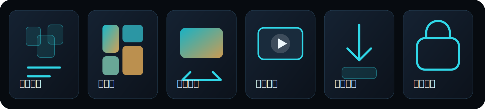
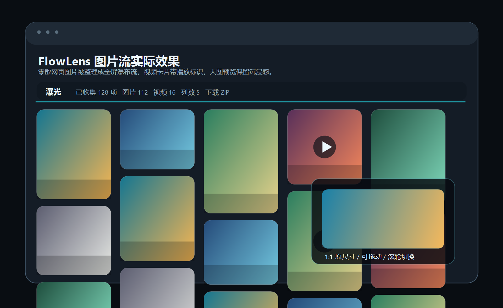
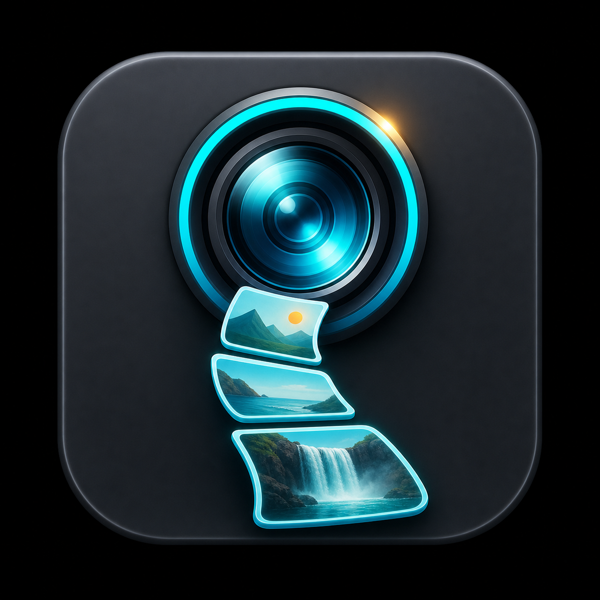

# 瀑光 FlowLens



瀑光 FlowLens 是一个把网页看图体验变顺手的小工具。它会把网页里零散、分页、尺寸不一的图片和视频收拢起来，整理成全屏瀑布流，让你像刷本地相册一样连续浏览、放大查看、切换上一张下一张，必要时还可以打包下载。

很多多图网页的问题都很具体：广告和正文混在一起，缩略图太小，下一页要反复点，点开大图会丢失浏览位置，视频和类 GIF 又要在不同播放器之间切换。瀑光做的就是把这些干扰拿掉，把注意力还给图片本身。



## ✨ 实际效果



打开网页后，点击右下角“瀑光”入口，页面会切换成一个全屏图片流：

- 📊 顶部显示已收集数量、图片/视频数量、列数和下载入口。
- 🌊 图片按瀑布流密集排布，一屏能看到更多内容。
- 🎬 视频卡片有半透明播放标识，不会在网格里自动播放。
- 🔍 点击图片或视频进入大图模式，支持滚轮、方向键和侧边箭头切换。
- 🖱️ 大图可在“适应屏幕”和“1:1 原尺寸”之间切换，原尺寸下可以拖动查看细节。

## 🧭 版本入口

当前统一版本：`v1.4.6`。电脑端与手机端入口分离，版本号保持同步；手机端通过稳定的 `flowlens-mobile-all.user.js` 更新通道升级，电脑端通过 `flowlens-extension/manifest.json` 维护版本。

### 💻 电脑端：Edge / Chrome 扩展

目录：`flowlens-extension/`

适合桌面 Edge、Chrome 使用。打开浏览器扩展管理页，开启开发者模式，然后选择这个目录“加载解压缩的扩展”。更新后在扩展管理页点击“重新加载”。

主要文件：

- `manifest.json`：浏览器扩展配置
- `content.js`：图片流主逻辑和界面
- `background.js`：下载、跨源抓取和自动重载
- `icons/`：扩展图标

### 📱 手机端：Android Edge / Tampermonkey

目录：`mobile-userscript/`

适合 Android Edge 安装 Tampermonkey 后使用。手机端推荐安装根目录的 `flowlens-mobile-all.user.js` 整合版；不要在电脑端安装手机整合版。

主要文件：

- `flowlens-mobile-all.user.js`：手机端整合安装入口
- `flowlens.user.js`：手机端主脚本
- `install-userscript.html`：安装/更新入口页
- `build-userscript.js`：从电脑端共享逻辑重新生成手机脚本

重新生成手机脚本：

```powershell
node mobile-userscript/build-userscript.js
```

## 🎯 能解决什么痛点



- 🧲 一键进入全屏图片流，不用在原网页里和广告、分页、布局较劲。
- 🎞️ 支持图片和类 GIF 视频：`mp4`、`webm`、`mov`、`m4v`。
- 🌊 瀑布流密集排布，一屏看到更多内容，适合快速筛选和沉浸浏览。
- ⌨️ 大图模式支持键盘、滚轮、侧边箭头切换，点空白处退出。
- 🔎 点击图片/视频可在“适应屏幕”和“1:1 原尺寸”之间切换。
- 🖐️ 原尺寸模式下可拖动查看细节。
- 🔒 本地运行，不上传图片；只处理当前页面和明确适配过的套图页面。

## 🛠️ 网页适配

瀑光默认会收集当前页面已有和动态新增的有效大图/媒体。对于结构复杂、分页特殊、需要接口数据或需要过滤干扰内容的网站，可以做单独适配。

如果你有想适配的网页，可以联系我。报酬按复杂度给就行，建议参考：

- 🟢 简单页面适配：50-100 元
- 🟡 分页、接口、视频混合适配：100-300 元
- 🔴 复杂站点、多站点批量适配或长期维护：另议

## 🧑‍💻 本地开发

修改电脑端扩展源码后运行：

```powershell
node --check flowlens-extension/content.js
node --check flowlens-extension/background.js
node -e "JSON.parse(require('fs').readFileSync('flowlens-extension/manifest.json','utf8')); console.log('manifest ok')"
```

同步到本地 Edge 加载目录：

```powershell
Copy-Item -Path flowlens-extension\* -Destination outputs\flowlens-extension -Recurse -Force
```

`outputs/` 是本机开发加载目录，不作为 GitHub 主要源码提交。
