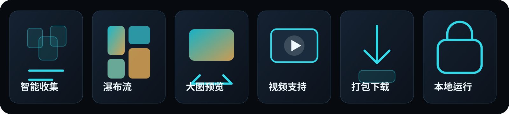

# 瀑光 FlowLens


> 把网页中的图片和视频，一键整理成沉浸式全屏瀑布流。当前版本：**v2.0.2**。

FlowLens 是一个浏览器工具：它会收集网页上零散、分页、尺寸不一的图片与视频，整理成可连续浏览、筛选、放大、收藏和下载的图片流。电脑端和手机端共享核心代码，手机端额外加载触控、窄屏和折叠屏适配。



## 快速安装

普通用户只需要安装下面两个正式入口之一：

| 版本 | 安装链接 | 适用场景 |
|---|---|---|
| 电脑端 | [安装/更新 FlowLens desktop](https://raw.githubusercontent.com/fallen0909/flowlens/master/flowlens-desktop.user.js) | Edge、Chrome、Firefox + Tampermonkey |
| 手机端 | [安装/更新 FlowLens mobile](https://raw.githubusercontent.com/fallen0909/flowlens/master/flowlens-mobile-all.user.js) | Android Edge、Kiwi、Firefox 等支持脚本管理器的移动浏览器 |
| 安装页 | [打开安装页](https://fallen0909.github.io/flowlens/) | 图形化安装入口 |

当前版本信息见 [version.json](version.json)。

## 2.0.2 更新重点

- 页面收藏与收藏列表移入设置，减少顶部工具栏占用。
- 大图模式移除链接抓取按钮，并修复缩放、拖动后按钮和箭头随内容漂移。
- 磁力/ED2K 面板支持 `M` 快捷键，并可联动 115 Magnet Play 批量或逐条保存到 CD2/115、逐条在浏览器播放。

## 2.0.1 更新重点

- 大图控件改为常驻节点，自动播放切图不再销毁控件或触发闪动动画。
- 新增大图缩放按钮，开启后支持滚轮连续缩放和拖动查看。
- 后续组改用独立图库图标并显示预览图。
- 新增 magnet / ed2k 页面下载链接抓取、复制与 TXT 导出。

## 2.0.0 更新重点

- “下一组”右侧新增组列表，可预览后续组标题并直接跳转。
- 设置面板改为更紧凑的分区布局，高级广告过滤与快捷键默认收起。
- 扩展设置页版本改为自动读取 manifest，避免再次显示旧版本号。

## 1.10.0 更新重点

- 修复大图自动播放按钮无法连续切换图片的问题。
- 优化图片流按需注入、分帧渲染和瀑布流布局，长列表加载与滚动更顺畅。
- 扩展设置和收藏迁移到扩展存储，并收紧下载与跨域请求权限。

## 1.9.9 更新重点

- 修复 1.9.8 中会话恢复与用户手动滚动抢控制权的问题，避免刚下拉就跳回顶部。
- 用户滚轮、触摸、拖动滚动条或使用键盘滚动时，会立即取消本次自动恢复。
- 恢复定位改为即时 `auto` 定位，避免平滑滚动动画造成回弹感。

## 功能

- 将页面图片和视频整理成全屏瀑布流。
- 支持图片/视频筛选、大图浏览、原始尺寸拖动、图库式滑动、稳定工具栏、幻灯片、下载与链接导出。
- 支持页面收藏、低频跨设备同步和诊断日志导出。
- 支持手机触控浏览、窄屏与折叠屏布局。
- 支持 Meitulu `item/编号.html`、`item/编号_2.html` 等多页套图补齐采集。
- 支持知乎页面同源重复媒体合并，避免重复卡片。

## 使用

### 电脑端

1. 安装 Tampermonkey。
2. 打开 [flowlens-desktop.user.js](flowlens-desktop.user.js) 并安装。
3. 打开任意网页，点击右下角“瀑光”入口。

### 手机端

1. 使用 Android Edge、Kiwi 或 Firefox 等支持脚本管理器的浏览器。
2. 安装 Tampermonkey。
3. 打开 [flowlens-mobile-all.user.js](flowlens-mobile-all.user.js) 并安装。

## 建议继续优化的方向

| 优先级 | 方向 | 目标 |
|---|---|---|
| 高 | 下载任务中心 | 显示成功、失败、跳过和可重试列表，提升批量下载可控性 |
| 高 | 缩略图到大图转场 | 从瀑布流卡片位置放大进入大图，进一步接近系统图库 |
| 中 | 智能高清解析缓存 | 对已解析过的高清地址做持久缓存，二次打开秒切高清 |
| 中 | 设置导入导出 | 方便手机和电脑同步列数、主题、自动滚动、收藏等设置 |
| 低 | 发布页美化 | 安装页展示版本、更新说明、电脑/手机步骤和常见问题 |

## 项目结构

```text
flowlens-desktop.user.js      电脑端正式安装入口
flowlens-mobile-all.user.js   手机端正式安装入口
apps/extension/               Chrome / Edge 扩展源码
src/                          两端共享源码
  core/                       核心逻辑
  patches/                    功能补丁
  mobile/                     手机端适配
docs/                         安装页、素材和历史资料
tools/                        构建、校验和本地开发工具
```

`src/` 是电脑端、手机端和扩展端共享逻辑的唯一来源。入口脚本采用多文件 `@require` 加载，方便快速更新和缓存失效。

## 开发与发布

```bash
node tools/validate-release.mjs
node tools/build-userscripts.mjs
node --check flowlens-desktop.user.js
node --check flowlens-mobile-all.user.js
```

GitHub Actions 已改为手动运行，避免普通提交触发不必要的失败邮件。需要打包时，可在 Actions 页面手动运行 `Verify and package FlowLens`。

完整历史记录请查看 [变更日志](docs/CHANGELOG.md)。
